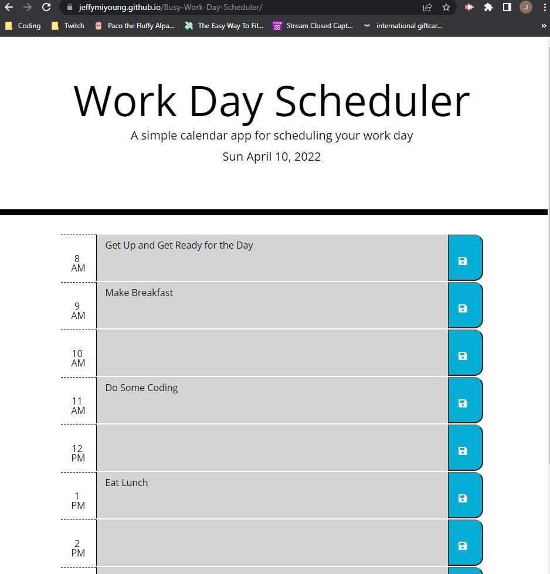

# Work Day Scheduler Starter Code
Got a Busy Schedule? Need a helping hand with maintaining your schedule? Worky - the Busy Day Scheduling App is here for you! As a developer, I wanted to create a multi-purpose tool that could help any user with their busy lives!

## Technologies: 
* HTML
* CSS
* JavaScript

## How To:
Navigate towards your specific time slot row, and type in your desired description for your task/errand/chore/etc. Then click on the `Save Icon` Button towards the right side of the time slot row to save your description! Green rows will be tasks in the future, Red rows are in the current hour, and Grey rows are past due tasks.

## Screenshot:
https://jeffymiyoung.github.io/Busy-Work-Day-Scheduler/

## Author(s):
* Bootcamp Developers for initial/starter code
* Jeffrey Young (HTML/JavaScript Editor)

## Contact Info:
Jeffrey Young: https://github.com/jeffymiyoung

---
© 2022 Worky - The Busy Day Scheduler